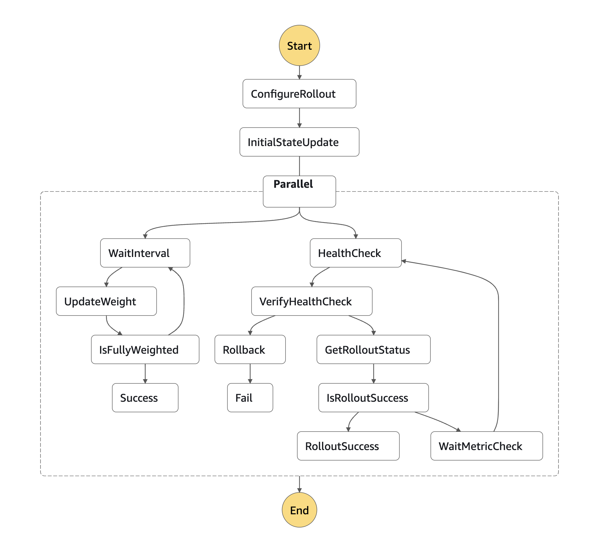

# Tweety SFN


Tweety is a Terraform module that enables **safe gradual rollouts for AWS Step Functions**.

It implements canary-style deployments by gradually shifting traffic between Step Function versions, continuously monitoring health metrics, and automatically rolling back if degradation is detected.

Tweety was built to bring a deployment experience similar to **Lambda + CodeDeploy** to **Step Functions managed with Terraform**.

The module can be used along with the public [`aws-step-functions`](https://github.com/terraform-aws-modules/terraform-aws-step-functions) module or the native terraform [`aws_sfn_state_machine`](https://registry.terraform.io/providers/hashicorp/aws/latest/docs/resources/sfn_state_machine) resource.

## Background

This module was originally built at Runa to safely roll out Step Function changes in production.

You can read the full engineering write-up here:

👉 [Stop Breaking Production: A Step Function Rollout Strategy That Works](ARTICLE_LINK)

## How it works

Tweety orchestrates Step Function rollouts using a dedicated rollout state machine.

During deployment it:

1. Publishes a new Step Function version
2. Gradually shifts traffic via Step Function aliases
3. Monitors CloudWatch metrics
4. Automatically rolls back if alarms trigger
5. Sends rollout updates to Slack

The rollout process is triggered automatically from Terraform whenever a new Step Function version is published.

## Infrastructure

Tweety infrastructure is designed to be deployed **once per AWS account** and reused by all gradual rollouts. The infrastructure can be deployed via:
```
module "tweety_infrastructure" {
  source = "./modules/infrastructure"

  slack_token_ssm_parameter = "/slack/token" # Your SSM parameter name for the Slack token
}
```

It executes the following state machine:


To get started quickly, set `create_infrastructure = true` to provision rollout-specific infrastructure alongside the module. This will create the infrastructure, alongside the module.

## Implementation guide

⚠️ Please follow the rollout migration steps **carefully** to avoid service downtime.

Implementing gradual rollouts requires two sequential pull requests.

#### First PR
1. Ensure step function is set to publish. This will create a new version every time there’s change to the step function.
1. Update the Step Function IAM role so it can invoke **both qualified and unqualified Lambda versions**.
1. Add the rollout alias using the `tweety-sfn` module.
1. Update the parent IAM role (the caller of the Step Function) to allow invoking both the alias and version ARNs.

#### Second PR
1. Ensure all child resources (Lambdas and nested Step Functions) are versioned.
1. Update references to use **qualified ARNs**.
1. Update the Step Function caller to invoke the **alias ARN** instead of the unqualified ARN.

## Rollout limits and sizing
AWS Step Functions have a hard limit of 25,000 state transitions. This is easily reached by Tweety if healthchecks are set to occur frequently for a long rollout. Terraform variable validation should catch this. If there are warnings about exceeding the limit then the health checks need to be less frequent or there needs to be fewer traffic shifts (fewer custom steps or larger traffic_shift_percentage) or the interval between traffic shifts needs to be shortened.

The formula to use to adjust your configuration is as follows:

*Number of transitions per traffic shift* = 9

*Number of transitions per healthcheck* = 9

*Number of traffic shifts* = 100 / `traffic_shift_percentage` OR 100 / length(`custom_steps`)

*Number of healthchecks* = (number of traffic shifts * `traffic_shift_interval_sec`) / `healthcheck_interval_sec`

*Total expected transitions* = (Number of traffic shifts * 9) + (Number of healthchecks * 9) + 15


This is not exact (it only accounts for the configured waits and not how long individual steps take. ie. It'll be more inaccurate for a very short rollout where the cold start time will be a significant % of the overall time of the rollout) but should be sufficient to warn against any potentially problematic configuration.

<!-- BEGIN_TF_DOCS -->
## Example

```hcl
resource "aws_iam_role" "sfn_role" {
  name = "step-functions-example-role"

  assume_role_policy = jsonencode({
    Version = "2012-10-17"
    Statement = [
      {
        Effect = "Allow"
        Principal = {
          Service = "states.amazonaws.com"
        }
        Action = "sts:AssumeRole"
      }
    ]
  })
}

resource "aws_sfn_state_machine" "example" {
  name     = "example"
  role_arn = aws_iam_role.sfn_role.arn
  publish  = true

  definition = templatefile("${path.module}/example.asl.json", {})
}

module "simple_rollout" {
  source = "../"

  alias_name  = "simple" # Optional, defaults to live
  version_arn = aws_sfn_state_machine.example.state_machine_version_arn

  trigger_gradual_rollout = true # Defaults to true

  traffic_shift_interval_sec = 60
  traffic_shift_percentage   = 20

  healthcheck_interval_sec = 10  # How often metrics will be checked during gradual rollout
  latency_threshold_ms     = 100 # Max duration of the step function we are rolling out. Used for degradation check

  slack_channel_id = "CHANNEL1234"
}

module "no_gradual_rollout" {
  source = "../"

  alias_name  = "nope"
  version_arn = aws_sfn_state_machine.example.state_machine_version_arn

  trigger_gradual_rollout = false
}

module "custom_steps" {
  source = "../"

  alias_name  = "custom_steps"
  version_arn = aws_sfn_state_machine.example.state_machine_version_arn

  # This will translate to weights [10, 10, 35, 60, 85, 100]
  custom_steps         = [10, 0, 25]
  latency_threshold_ms = 100

  slack_channel_id = "CHANNEL1234"
}

module "create_infrastructure" {
  source = "../"

  alias_name  = "infra"
  version_arn = aws_sfn_state_machine.example.state_machine_version_arn

  create_infrastructure     = true
  slack_token_ssm_parameter = "/slack/token"
  tweety_prefix             = "example"

  trigger_gradual_rollout = true # Defaults to true

  traffic_shift_percentage = 20
  latency_threshold_ms     = 100

  slack_channel_id = "CHANNEL1234"
}

module "custom_monitor" {
  source = "../"

  alias_name  = "custom_monitor"
  version_arn = aws_sfn_state_machine.example.state_machine_version_arn

  traffic_shift_percentage = 20
  latency_threshold_ms     = 100

  additional_alarms = [aws_cloudwatch_metric_alarm.additional_alarm.alarm_name]

  slack_channel_id = "CHANNEL1234"
}

resource "aws_cloudwatch_metric_alarm" "additional_alarm" {
  alarm_name          = "example-api-monitor"
  alarm_description   = "Monitor 5xx errors on the API endpoint"
  comparison_operator = "GreaterThanThreshold"
  evaluation_periods  = 1
  threshold           = 0
  period              = 60
  unit                = "Count"
  treat_missing_data  = "notBreaching"

  namespace   = "AWS/ApiGateway"
  metric_name = "5XXError"
  statistic   = "Maximum"

  dimensions = {
    ApiName  = "api-name"
    Resource = "/endpoint-path"
    Method   = "POST"
  }
}
```

## Requirements

| Name | Version |
|------|---------|
| <a name="requirement_terraform"></a> [terraform](#requirement\_terraform) | ~> 1.9 |
| <a name="requirement_aws"></a> [aws](#requirement\_aws) | ~> 6.11 |
| <a name="requirement_awscc"></a> [awscc](#requirement\_awscc) | ~> 1.10 |

## Resources

| Name | Type |
|------|------|
| [aws_sfn_alias.gradual_rollout_alias](https://registry.terraform.io/providers/hashicorp/aws/latest/docs/resources/sfn_alias) | resource |
| [null_resource.run_gradual_rollout](https://registry.terraform.io/providers/hashicorp/null/latest/docs/resources/resource) | resource |
| [null_resource.update_alias_version](https://registry.terraform.io/providers/hashicorp/null/latest/docs/resources/resource) | resource |
| [aws_caller_identity.current](https://registry.terraform.io/providers/hashicorp/aws/latest/docs/data-sources/caller_identity) | data source |
| [aws_region.current](https://registry.terraform.io/providers/hashicorp/aws/latest/docs/data-sources/region) | data source |
| [aws_sfn_alias.live](https://registry.terraform.io/providers/hashicorp/aws/latest/docs/data-sources/sfn_alias) | data source |
| [aws_sfn_state_machine.gradual_rollout_sfn](https://registry.terraform.io/providers/hashicorp/aws/latest/docs/data-sources/sfn_state_machine) | data source |
| [awscc_stepfunctions_state_machine_alias.gradual_rollout_alias](https://registry.terraform.io/providers/hashicorp/awscc/latest/docs/data-sources/stepfunctions_state_machine_alias) | data source |

## Inputs

| Name | Description | Type | Default | Required |
|------|-------------|------|---------|:--------:|
| <a name="input_additional_alarms"></a> [additional\_alarms](#input\_additional\_alarms) | A list of additional CloudWatch alarm names to monitor during the gradual rollout process. | `list(string)` | `[]` | no |
| <a name="input_alias_description"></a> [alias\_description](#input\_alias\_description) | Custom description of the new alias, created for the gradual rollout. | `string` | `"Gradual rollout alias."` | no |
| <a name="input_alias_name"></a> [alias\_name](#input\_alias\_name) | The new alias name which will be created for the gradual rollouts. Defaults to live. | `string` | `"live"` | no |
| <a name="input_create_infrastructure"></a> [create\_infrastructure](#input\_create\_infrastructure) | Whether to create a new tweety-sfn for the gradual rollout. By default, it'll try to reuse the `tweety-sfn`. | `bool` | `false` | no |
| <a name="input_custom_steps"></a> [custom\_steps](#input\_custom\_steps) | Instead of linear gradual deployment, it's possible to customise the steps according to rollout requirements. Required if `traffic_shift_percentage` is not set. | `list(number)` | `null` | no |
| <a name="input_environment"></a> [environment](#input\_environment) | Application environment name to be used during the notifications. If not configured the account name is used. | `string` | `null` | no |
| <a name="input_healthcheck_interval_sec"></a> [healthcheck\_interval\_sec](#input\_healthcheck\_interval\_sec) | Frequency of the metric checks during the gradual rollout, defined in seconds. | `number` | `30` | no |
| <a name="input_latency_threshold_ms"></a> [latency\_threshold\_ms](#input\_latency\_threshold\_ms) | Maximum duration of the step function can run before rollback is initiated, defined in seconds. | `number` | `null` | no |
| <a name="input_override_error_rate_monitor"></a> [override\_error\_rate\_monitor](#input\_override\_error\_rate\_monitor) | If set to true, disables error rate monitoring during health checks. Make sure you have other ways to monitor errors. | `bool` | `false` | no |
| <a name="input_slack_channel_id"></a> [slack\_channel\_id](#input\_slack\_channel\_id) | Slack channel ID where the rollout notifications will be sent to. | `string` | `null` | no |
| <a name="input_slack_token_ssm_parameter"></a> [slack\_token\_ssm\_parameter](#input\_slack\_token\_ssm\_parameter) | SSM parameter name containing the Slack token used for rollout notifications. | `string` | `""` | no |
| <a name="input_traffic_shift_interval_sec"></a> [traffic\_shift\_interval\_sec](#input\_traffic\_shift\_interval\_sec) | Frequency of the traffic shifting assuming the health checks are passing, defined in seconds. | `number` | `60` | no |
| <a name="input_traffic_shift_percentage"></a> [traffic\_shift\_percentage](#input\_traffic\_shift\_percentage) | Percentage of the traffic that's being increased in each interval. Required if `custom_steps` is not set. | `number` | `null` | no |
| <a name="input_trigger_gradual_rollout"></a> [trigger\_gradual\_rollout](#input\_trigger\_gradual\_rollout) | Specifies whether gradual rollout will be triggered. | `bool` | `true` | no |
| <a name="input_tweety_prefix"></a> [tweety\_prefix](#input\_tweety\_prefix) | Prefix used when creating the Tweety Step Functions infrastructure. | `string` | `""` | no |
| <a name="input_version_arn"></a> [version\_arn](#input\_version\_arn) | ARN pointing to the new version of the step function we wish to roll out. | `string` | n/a | yes |

## Outputs

| Name | Description |
|------|-------------|
| <a name="output_alias_arn"></a> [alias\_arn](#output\_alias\_arn) | Alias ARN, which can be used to reference the rollout in the parents. |
<!-- END_TF_DOCS -->

## License

Apache License 2.0

Copyright 2026 Runa Network Limited

See `LICENSE` for details.
